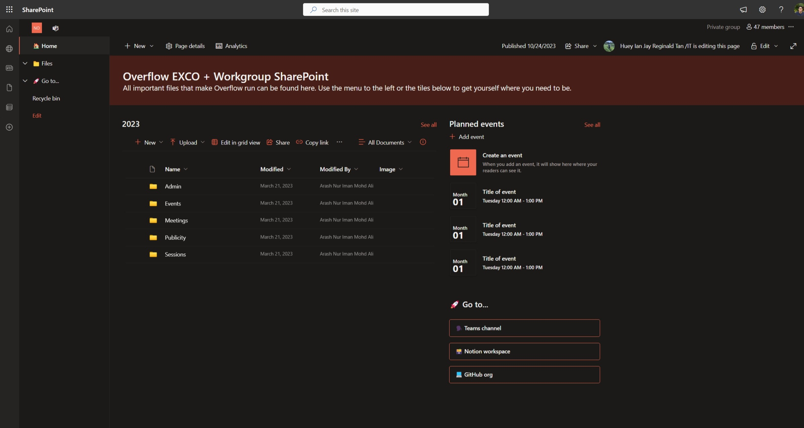
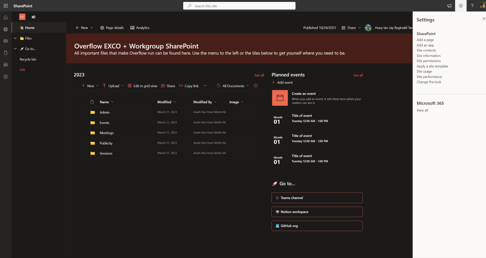
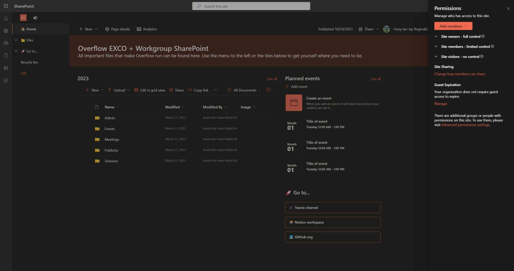
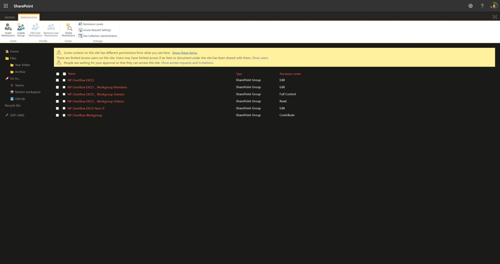
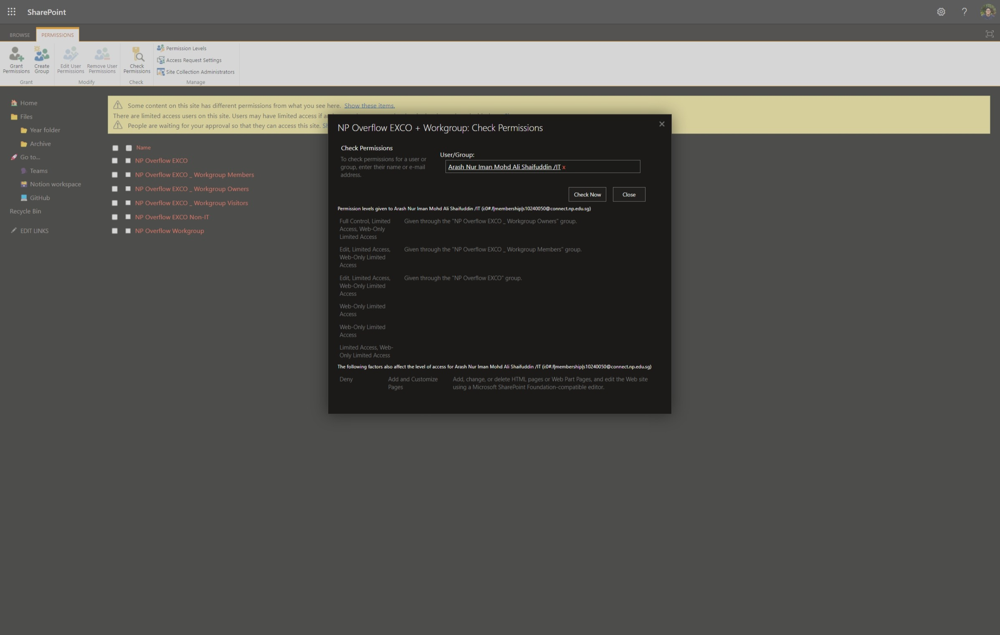
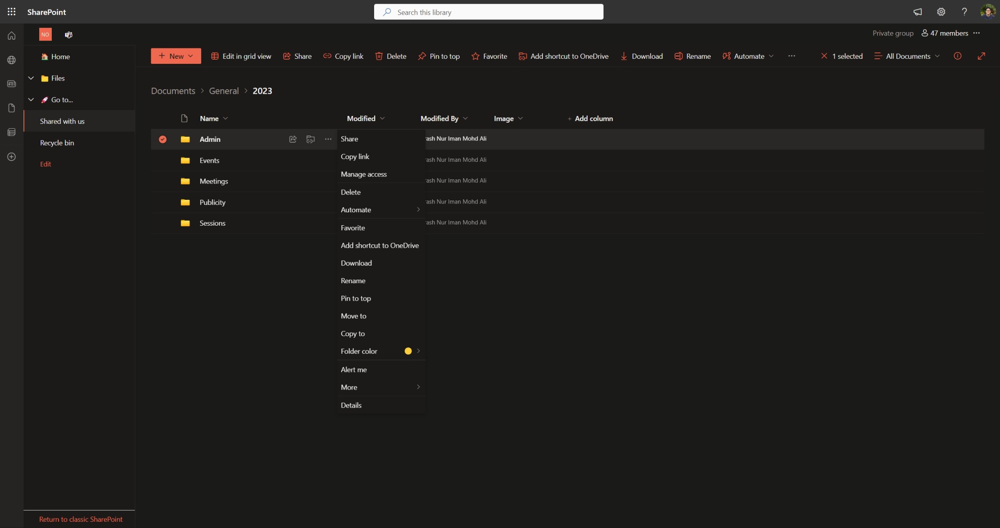
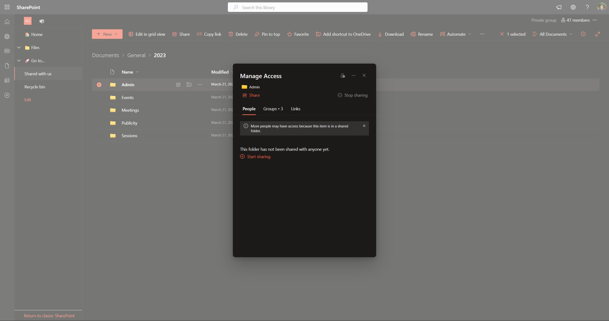
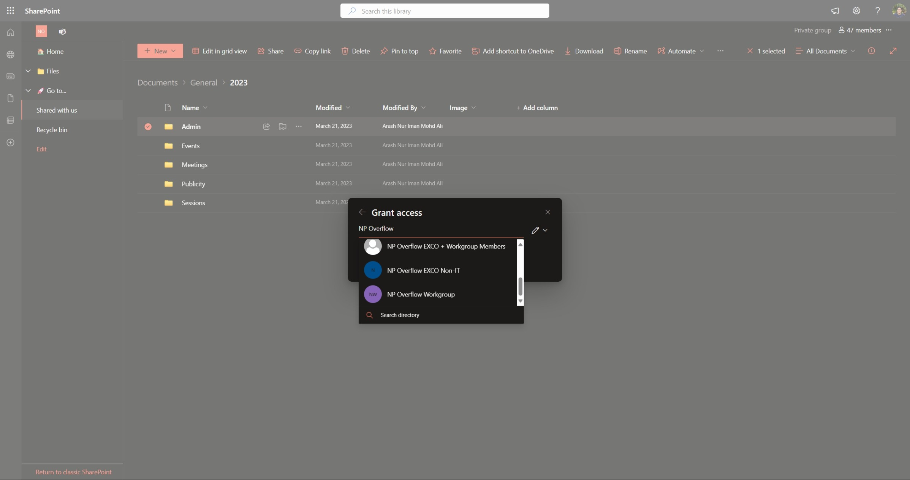
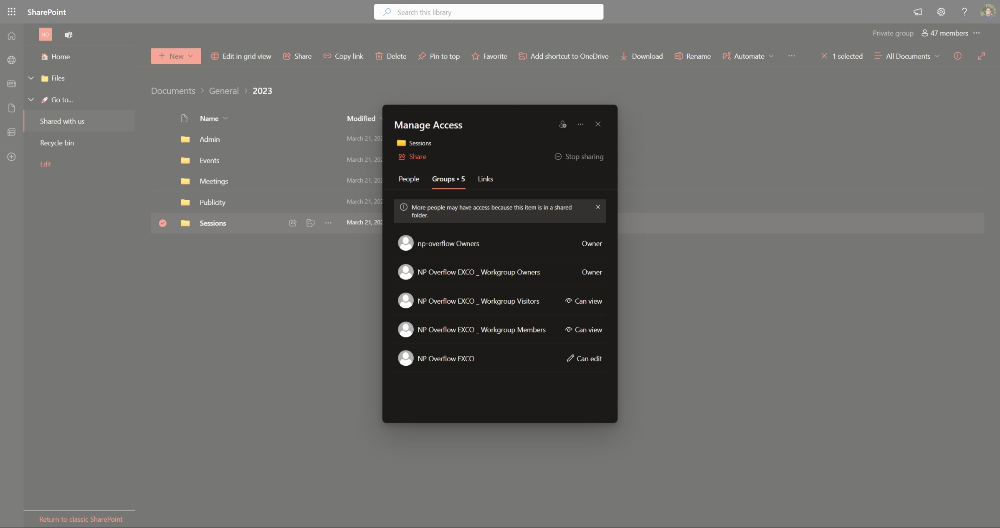

# Access Control

## SharePoint

The SharePoint site is associated with the `np-overflow` team, and by default, all members of the `np-overflow` team will be able to access all files on the SharePoint site. **This includes all members invited to the team, including Workgroup members.**

While the Microsoft Teams UI doesn't offer access control capabilities, the associated SharePoint interface can be used to implement these features. The following guidelines should be used:

- In Microsoft Teams, the P/VPs and lecturers should be owners of the team. Other EXCO members and Workgroup members should be members of the team.
- In SharePoint, EXCO members should be associated with the role "NP Overflow EXCO". Workgroup members should be associated with the role "NP Overflow Workgroup"
- Roles can be created as needed (i.e. certain events require more specific restrictions, like ByteHackz requiring non-IT EXCO members), but their need should be carefully considered before creation.

### Principle of least privilege

Common with data security, the principle of least privilege should be applied to the SharePoint site. This means that members should only have access to the files and data that they need to perform their job functions. We can apply this principle in practice with the following guidelines:

- The P/VPs and lecturers should have full access to all files on the SharePoint site. This includes the ability to create, edit, and delete files.
- The EXCO members should have access to most[^1] files on the SharePoint site, with their ability to create, edit, and delete files restricted to some files as required. We generally do not restrict access based on the member's role in the EXCO to keep things simple.
- The Workgroup members should only have access to files that are relevant to their functioning. Access must be restricted by default and only granted when necessary.

### Accessing SharePoint's roles page

It can get a little confusing to access SharePoint's permissions interface, so here's a quick guide on how to do it:

1. Open up the [SharePoint site](https://connectnpedu.sharepoint.com/sites/np-overflow). 

2. Click on the Settings icon (the gear icon) on the top right corner of the page.
3. On the sidebar that appears, click on "Site permissions". 

4. On the page that appears, click on "Advanced permissions settings". 

5. On the page that appears, you'll be able to create, edit, and delete roles, which can then be associated with members of the site to control their access. 

!!! tip

    The "Advanced permissions settings" page is where you can create, edit, and delete roles, and associate them with members of the site to control their access. While there isn't a way to preview the site as a member of a role, you can use the "Check Permissions" feature to see what access a member has and through which role they have it.

    

!!! warning

    The following roles are created by default and should **not** be deleted unless you know what you're doing:

    - NP Overflow EXCO _ Workgroup Members
    - NP Overflow EXCO _ Workgroup Owners
    - NP Overflow EXCO _ Workgroup Visitors

    Within NP Overflow EXCO _ Workgroup Members, there's also a member named "np-overflow Members". Again, unless you know what you're doing, do not delete this member.

### Managing access (files and folders)

The UI to manage access to roles can be a little confusing to find at times. Here's a quick guide on how to do it:

1. On the SharePoint interface, click the three dots next to the file or folder you want to manage access to.
2. Click on "Manage access". 
3. In the pop up that appears, click the Grant Access (the user with a plus sign) button to add a role to the file or folder. 
4. You can then search for the role you want to add and click on it to add it to the file or folder. You can choose whether the role will have editing, reading, or downloading rights. 

!!! warning

    By default, SharePoint will grant read access to **all the default roles**. This may create unintended effects, like allowing Workgroup members to access files that they shouldn't (i.e., although they are in the NP Overflow Workgroup role that wasn't explicitly given permission, they can still read files because they are a part of NP Overflow EXCO _ Workgroup Members). Be sure to remove access from roles that shouldn't have it, especially the default roles.

    

## GitHub

All of our code is hosted on GitHub under the [`np-overflow`](https://github.com/np-overflow) organisation. GitHub offers some level of access control, and we can use it to manage access to our repositories. The following guidelines should be used:

- EXCO members and Workgroup members may be directly invited as a member of the organisation.
- EXCO members should be added to a team named "XXXX EXCO", where "XXXX" is the year of their term. Workgroup members should be added to a team named "XXXX Workgroup", where "XXXX" is the year of their term.

[^1]: There may be cases where the EXCO needs to be restricted from accessing certain files, like for ByteHackz. In these cases, a new role should be created and the file permissions should be updated accordingly.
